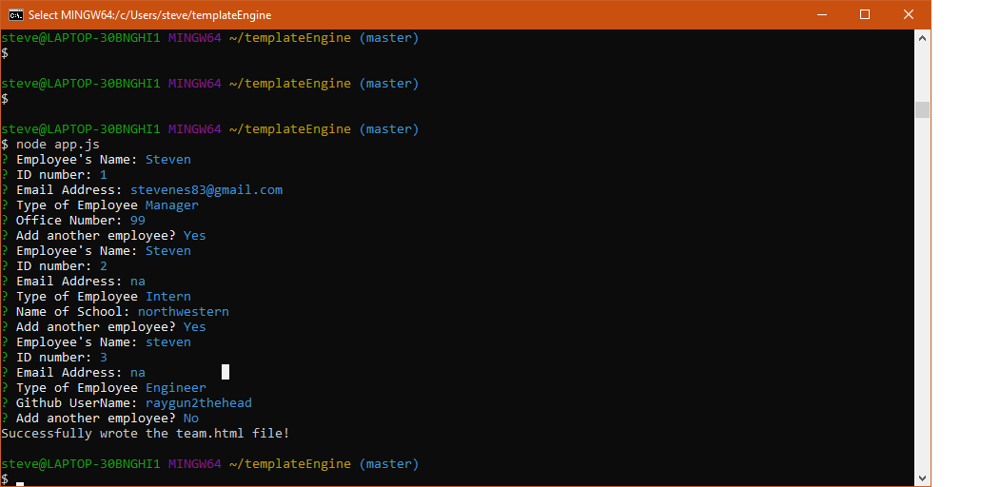
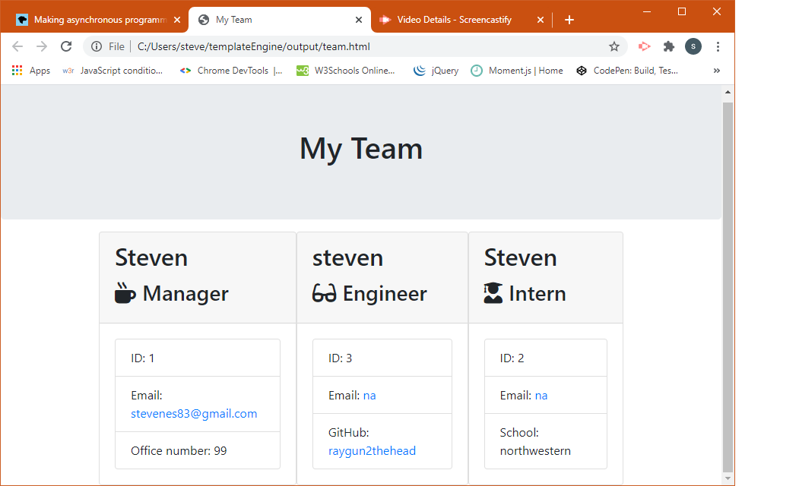

# Template Engine

## Description 
  Use this app as a template to putting together different combinations of objects that belong to a subclass of a class.
 ### Images
 
 
 ### Screencastify
 [Walk through video](https://drive.google.com/file/d/1i74kkikc7EnLuMaEtT8t0rra03BF-uDl/view?usp=sharing)
## Table of contents 
 - [Installation](#installation) 
 - [Usage](#usage) 
 - [contributing](#contributing) 
 - [Tests](#tests) 
## Installation 
 Git pull, or download.
## Usage 
 Once project is installed, run node.js in the command line and follow the prompts. The app will overwrite team.html in the output folder.
## License 
 
## Contributing 
 Steven Schaab 
## Tests 
 N/A 
## Questions 
 - [Github](https://github.com/Raygun2thehead) 
 - [Email](mailto:stevenes83@gmail.com)